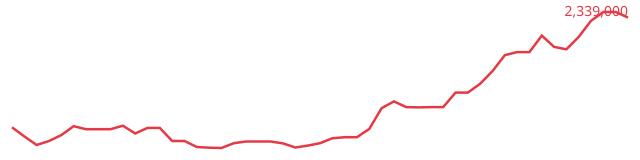
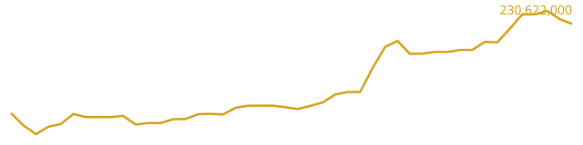

# 📈 Iran Gold & USD Tracker | آرشیو تاریخی قیمت دلار و طلا در ایران

آرشیو باز و رایگانِ روزانه‌ی قیمت **دلار بازار آزاد**، **طلای ۱۸ عیار**، **سکه امامی** و **اونس جهانی طلا**، که به‌صورت کاملاً خودکار با GitHub Actions جمع‌آوری می‌شه.


<!-- LATEST:START -->
_آخرین بروزرسانی: 2026-07-25 — ساعت 19:55 به وقت تهران_

| شاخص | مقدار | ساعت بروزرسانی |
|---|---|---|
| 💵 دلار (بازار آزاد) | 1,897,000 ریال | 19:55 |
| 🥇 اونس جهانی طلا | 4,053 دلار | 19:55 |
| 🟡 طلای ۱۸ عیار (هر گرم) | 182,711,000 ریال | 19:55 |
| 🪙 سکه امامی | 1,845,050,000 ریال | 19:55 |



<!-- LATEST:END -->

---

## چرا این پروژه؟

قیمت طلا در ایران فقط تابع اونس جهانی نیست؛ چون به ریال قیمت‌گذاری می‌شه، نرخ دلار آزاد هم مستقیم روش اثر می‌ذاره. اکثر API‌های موجود برای این داده یا محدودیت روزانه دارن، یا نیاز به ثبت‌نام/پرداخت دارن، یا هیچ‌کدوم تاریخچه‌ی باز و قابل دانلود ارائه نمی‌دن.

این ریپو یه جایگزین ساده‌ست: هر روز یه اسنپ‌شات از قیمت‌ها می‌گیره و توی یه فایل CSV عمومی نگه می‌داره — بدون کلید API، بدون سقف درخواست، بدون ثبت‌نام.

## داده‌ها از کجا میان؟

قیمت‌ها از صفحات عمومی [tgju.org](https://www.tgju.org) استخراج می‌شن (HTML parsing، نه از طریق API رسمی اون‌ها). این یعنی:
- اگه ساختار صفحه‌ی tgju تغییر کنه، اسکریپت ممکنه از کار بیفته تا اصلاح شه.
- درخواست‌ها با فاصله‌ی زمانی و فقط یک‌بار در روز زده می‌شن؛ (با cron داخل فایل .yml میتونید زمانش رو تغییر بدین).
- این پروژه هیچ ارتباط رسمی با tgju.org نداره.

## استفاده از داده‌ها

تاریخچه‌ی کامل توی [`data/history.csv`](data/history.csv) نگه داشته می‌شه. می‌تونی مستقیم از طریق raw.githubusercontent.com توی پروژه‌ی خودت (بدون هیچ محدودیتی) استفاده کنی:

```
https://raw.githubusercontent.com/USERNAME/REPO/main/data/history.csv
```

### ساختار فایل

| ستون | توضیح | واحد |
|---|---|---|
| `date` | تاریخ میلادی ثبت (UTC) | `YYYY-MM-DD` |
| `timestamp` | زمان یونیکس | ثانیه |
| `usd` | قیمت دلار، بازار آزاد تهران | ریال |
| `gram18` | قیمت هر گرم طلای ۱۸ عیار | ریال |
| `sekkeh` | قیمت سکه امامی | ریال |
| `ounce` | قیمت اونس جهانی طلا | دلار |

مثال با pandas:

```python
import pandas as pd

df = pd.read_csv(
    "https://raw.githubusercontent.com/USERNAME/REPO/main/data/history.csv"
)
df.plot(x="date", y="usd")
```

۳. نصب وابستگی‌ها و تست لوکال:
   ```bash
   pip install -r requirements.txt
   python scripts/update.py
   ```
۴. توی تنظیمات ریپو، مسیر **Settings → Actions → General → Workflow permissions** رو روی **Read and write permissions** بذار تا Action بتونه commit/push کنه.
۵. از تب **Actions** یه‌بار workflow رو دستی (`Run workflow`) اجرا کن تا مطمئن بشی همه‌چی درسته.

بعد از اون، هر روز ساعت ۱۹:۰۰ به وقت تهران خودکار اجرا می‌شه (`.github/workflows/update.yml`).

## محدودیت‌ها

- این یه ابزار پژوهشی/شخصیه، نه منبع مالی رسمی برای تصمیم‌گیری معاملاتی.
- دقت داده به دقت خود tgju.org وابسته‌ست.
- اگه HTML سایت تغییر کنه، ممکنه چند روز طول بکشه تا اصلاح بشه.

## مشارکت

اگه یه اسلاگ اشتباهه، یا منبع بهتری سراغ دارین، یه Issue یا Pull Request باز کنید.

## لایسنس

کد و داده‌ها تحت [MIT License](LICENSE) منتشر شدن — آزادانه قابل استفاده هستن.
